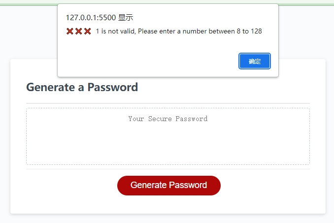

# passwordGenerator

## Description

A page that can generate random password with a length of min 8 characters to max 128 characters with the any of the four types (lowercase, uppercse, numbers & special characters) of characters. highlights:
- several prompts to guild the user to the desired outcome.
- guarantee of all chosen types of characters are in the outcome.
- random outcome for more security.
- react to wrong choices or inputs. 
- page is adaptable to the different screen size.

## Illustration

open and view the contents on https://mkdkck.github.io/passwordGenerator/

the page should show like the following pic:
option prompts:

successful outcome:

wrong input warnings:

HTML, CSS & JS codes can be examined on https://github.com/mkdkck/passwordGenerator

## Usage

- open the link to see a fully fucntional website.
- click the generate password buttom to start the generation of password.
- follow the instructions of the prompts to get the desired combination.
- open Index.html, style.css and script.js in repo to see the correct semantic elements and attributes.

## License

N/A

## Badges

